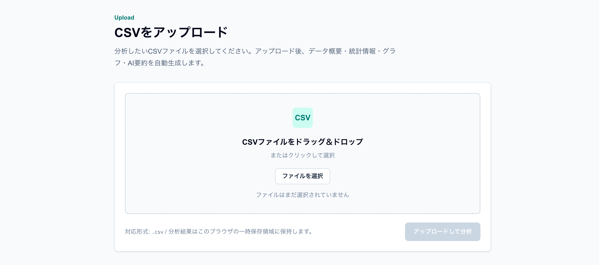
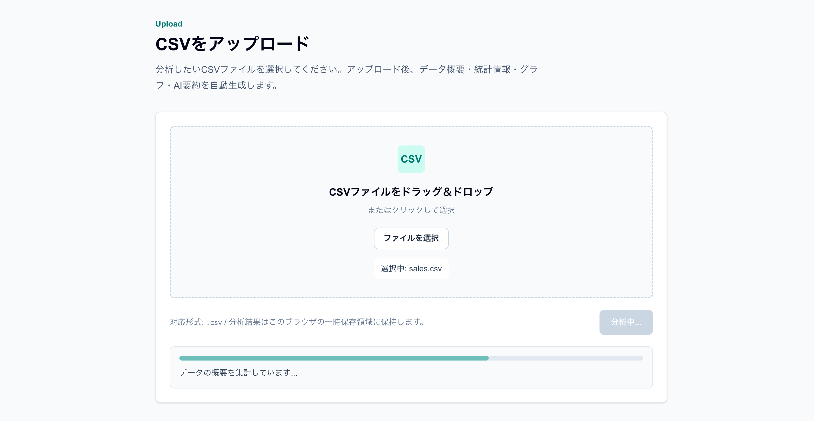
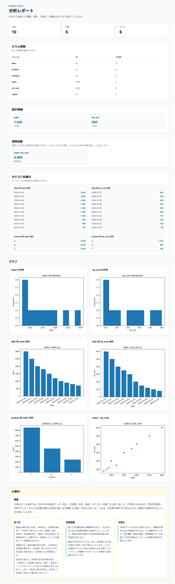
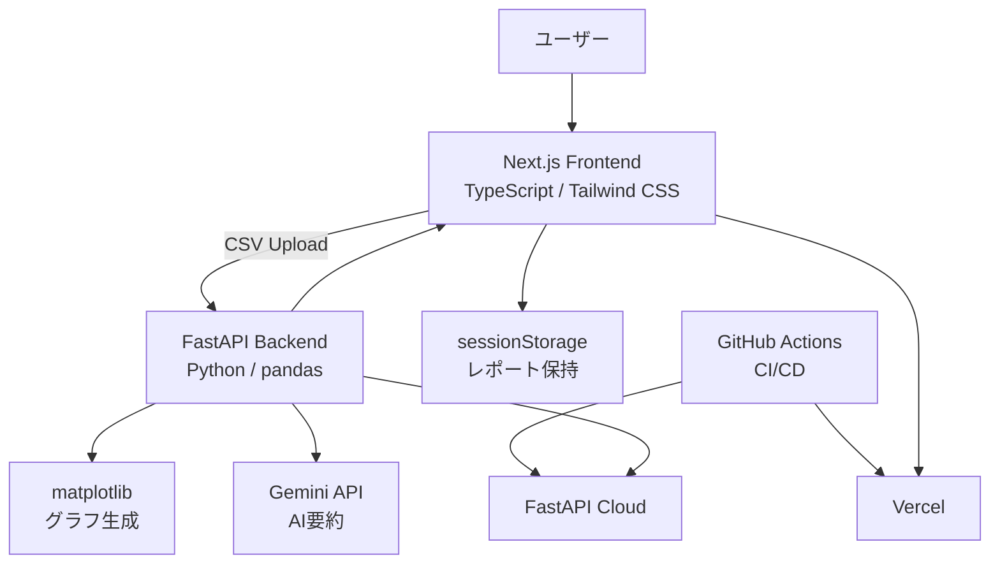

# Insight Report AI

CSVをアップロードするだけで、データ分析・可視化・AIによる要約を自動生成するWebアプリケーションです。  
非エンジニアでも簡単にデータから示唆を得られることを目的としています。

---

## 🔗 デモ

https://insight-report-ai-kensuke.vercel.app/

---

## 📸 スクリーンショット

### アップロード画面

CSVファイルをドラッグ＆ドロップ、またはファイル選択でアップロードできます。



### 分析中（ローディング）

CSV読み込み・集計・グラフ生成・AI要約生成の進捗を表示します。



### レポート画面

データ概要、欠損値、基本統計量、グラフ、相関係数、AI要約をレポート形式で表示します。



---

## 🏗 システム構成



---

### データ分析フロー

1. CSVファイルをアップロード
2. FastAPIでCSVを解析
3. pandasでEDA（統計・相関分析）
4. matplotlibでグラフ生成
5. Gemini APIでAI要約生成
6. Next.jsでレポート表示
7. Markdown / PDFでレポート出力

---

## 🎯 背景・課題

多くの業務現場では以下の課題があります。

- データはあるが分析できない
- Excelでの分析に時間がかかる
- 分析結果を文章にまとめるのが難しい

特に非エンジニアにとって、データ活用のハードルは高いと感じました。

---

## 💡 解決したこと

本アプリでは、CSVをアップロードするだけで以下を自動生成します。

- データ概要（行数・列数・型）
- 欠損値チェック
- 基本統計量
- グラフ（ヒストグラム）
- AIによる要約・示唆・改善提案

---

## 🧠 工夫した点（ここが重要）

### ① 非エンジニア向けUX設計

- CSVアップロードのみで分析可能
- ローディング画面で処理状況を可視化
- 結果をレポート形式で表示

---

### ② AI要約のフォールバック設計

- Gemini APIを使用して自然言語要約を生成
- APIキー未設定・エラー時はルールベース要約に自動切替

```txt
Gemini API → 失敗 → ルールベース
```

👉 実務を意識した耐障害設計

---

### ③ フルスタック構成

- フロントエンドとバックエンドを分離
- API設計から実装まで一貫して開発

---

### ④ 段階的なMVP開発

- まずは最小機能で動く状態を構築
- その後、グラフ・AI・UXを追加

---

## 🏗️ 技術スタック

### フロントエンド

- Next.js (App Router)
- TypeScript
- Tailwind CSS

### バックエンド

- FastAPI
- pandas
- matplotlib

### AI

- Gemini API（google-genai）
- ルールベース要約（フォールバック）

### その他

- uv（Pythonパッケージ管理）
- PostgreSQL（将来拡張予定）

---

## ⚙️ デプロイ構成

- フロントエンド：Vercel
- バックエンド：FastAPI Cloud
- GitHub Actions による自動デプロイ

---

## 🔧 セットアップ

### バックエンド

```bash
cd backend
uv sync
uv run fastapi dev app/main.py
```

---

### フロントエンド

```bash
cd frontend
npm install
npm run dev
```

---

## 🔑 環境変数（任意）

Gemini APIを使用する場合のみ設定

```env
GEMINI_API_KEY=your_api_key
GEMINI_MODEL=gemini-2.5-flash-lite
```

※未設定でもルールベース要約で動作します

---

## 🚀 今後の改善

- レポートのPDF出力
- ユーザー認証・履歴保存
- 相関分析の可視化
- グラフの種類追加
- RAGによる業務知識統合

---

## 🧩 このアプリでアピールできること

- データ分析（EDA）の実装力
- Webアプリ開発（Next.js + FastAPI）
- AIの実務的な組み込み
- フォールバック設計（耐障害性）
- 非エンジニア向けのUX設計

---

## 👤 作成者

太田 健介

---

## 📄 ライセンス

MIT
