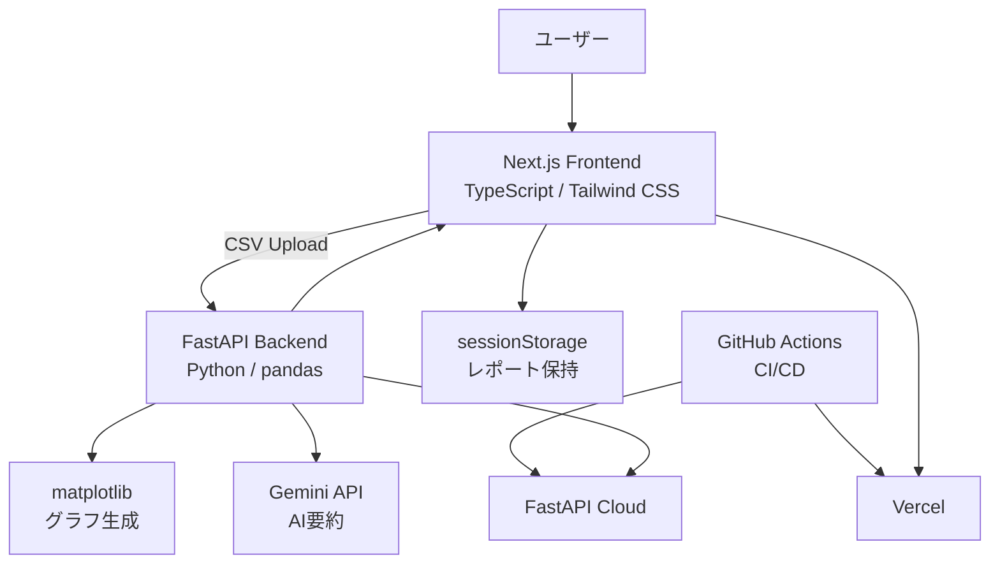

# Insight Report AI


CSVをアップロードするだけで、EDA（探索的データ分析）・可視化・AI要約レポート生成を自動で行う、非エンジニア向けAI分析Webアプリです。

データ分析のハードルを下げ、「データはあるが分析できない」という課題の解決を目的としています。

---

## ✨ 特徴

- CSVアップロードのみで分析可能
- AIによる重要ポイント抽出
- 相関分析・カテゴリ分析・時系列分析に対応
- Markdown / PDFレポート出力
- Gemini API失敗時のフォールバック設計
- GitHub ActionsによるCI/CD

---

## 🔗 デモ

https://insight-report-ai-kensuke.vercel.app/

---

## 📸 スクリーンショット

### アップロード画面

CSVファイルをドラッグ＆ドロップ、またはファイル選択でアップロードできます。


### 分析中（ローディング）

CSV読み込み・集計・グラフ生成・AI要約生成の進捗を表示します。


### レポート画面

データ概要、欠損値、基本統計量、グラフ、相関係数、AI要約をレポート形式で表示します。


---

## 🏗 システム構成図



---

## ✨ 主な機能

### 📂 CSVアップロード

- ドラッグ＆ドロップ対応
- ファイル選択対応

### 👀 データプレビュー

- CSVの先頭5行を表示
- 分析対象データを事前確認可能

### 📊 EDA（探索的データ分析）

- 行数・列数
- 型情報
- 欠損値チェック
- 基本統計量

### 📈 可視化

- ヒストグラム
- 相関分析
- 散布図
- カテゴリ別集計
- 時系列分析

### 🤖 AI要約

- Gemini APIによる自然言語要約
- 重要ポイント抽出
- 改善提案生成

### 🛡 フォールバック設計

- Gemini API失敗時はルールベース要約へ切替

### 📄 レポート出力

- Markdownダウンロード
- PDF保存

---

### データ分析フロー

1. CSVファイルをアップロード
2. FastAPIでCSVを解析
3. pandasでEDA（統計・相関分析）
4. matplotlibでグラフ生成
5. Gemini APIでAI要約生成
6. Next.jsでレポート表示
7. Markdown / PDFでレポート出力

---

## 🎯 背景・課題

多くの業務現場では以下の課題があります。

- データはあるが分析できない
- Excelでの分析に時間がかかる
- 分析結果を文章にまとめるのが難しい

特に非エンジニアにとって、データ活用のハードルは高いと感じました。

---

## 💡 解決したこと

本アプリでは、CSVをアップロードするだけで以下を自動生成します。

- データ概要（行数・列数・型）
- 欠損値チェック
- 基本統計量
- グラフ（ヒストグラム・散布図・棒グラフ・折れ線グラフ）
- AIによる要約・示唆・改善提案

---

## 🧠 工夫した点

### ① 非エンジニア向けUX設計

- CSVアップロードのみで分析可能
- ローディング画面で処理状況を可視化
- 結果をレポート形式で表示

---

### ② AI要約のフォールバック設計

- Gemini APIを使用して自然言語要約を生成
- APIキー未設定・エラー時はルールベース要約に自動切替

```txt
Gemini API → 失敗 → ルールベース
```

👉 実務を意識した耐障害設計

---

### ③ フルスタック構成

- フロントエンドとバックエンドを分離
- API設計から実装まで一貫して開発

---

### ④ 段階的なMVP開発

- まずは最小機能で動く状態を構築
- その後、グラフ・AI・UXを追加

---

## 🏗️ 技術スタック

### フロントエンド

- Next.js (App Router)
- TypeScript
- Tailwind CSS

### バックエンド

- FastAPI
- pandas
- matplotlib

### AI

- Gemini API（google-genai）
- ルールベース要約（フォールバック）

### その他

- uv（Pythonパッケージ管理）

---

## 🧠 技術選定理由

### Next.js

- App Routerによるモダンな構成
- TypeScriptとの相性
- Vercelとの親和性

### FastAPI

- Pythonによるデータ分析との統合が容易
- 型ベースでAPIを実装できる
- 高速なAPI開発が可能

### pandas

- EDA（探索的データ分析）の実装が容易
- 実務でも広く利用されている

### matplotlib

- サーバー側でグラフ生成が可能
- 画像として返却できるためフロント実装がシンプル

### Gemini API

- 無料枠が利用可能
- 自然言語要約を高速に生成可能

### GitHub Actions

- frontend/backend を分離して自動デプロイ
- モノレポ構成でもCI/CDを管理しやすい

---

## ⚙️ デプロイ構成

- フロントエンド：Vercel
- バックエンド：FastAPI Cloud
- GitHub Actions による自動デプロイ

---

## 🔧 セットアップ

### バックエンド

```bash
cd backend
uv sync
uv run fastapi dev app/main.py
```

---

### フロントエンド

```bash
cd frontend
npm install
npm run dev
```

---

## 🔑 環境変数（任意）

Gemini APIを使用する場合のみ設定

```env
GEMINI_API_KEY=your_api_key
GEMINI_MODEL=gemini-2.5-flash-lite
```

※未設定でもルールベース要約で動作します

---

## 🚀 今後の改善

- レポート履歴保存機能
- ユーザー認証
- 分析テンプレート機能
- AIチャットによる追加分析
- 大規模CSV対応
- RAGによる業務知識統合
- 異常値検知
- ダッシュボード共有機能

---

## 👤 作成者

太田 健介

---

## 📄 ライセンス

MIT
